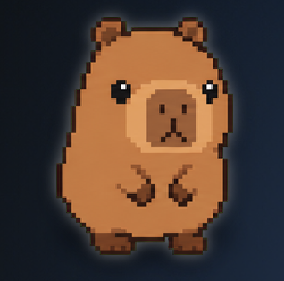

<div align="center">

# 🐾 OpenPet

**A native macOS desktop companion for AI workflows.**

*Bringing the Codex Pets experience to every agent tool — no vendor lock-in.*

[](https://www.apple.com/macos/)
[](https://swift.org)
[](LICENSE)
[]()

</div>

---

## What Is OpenPet?

OpenPet recreates the delightful ambient desktop pet experience from Codex Pets — but makes it **agent-agnostic**. The same companion follows your AI work whether you're in Codex, Codex CLI, Claude Code, OpenCode, T3 Code, or something else entirely.

> The repo's Swift package product is named `CompanionPet`, but the project itself is `OpenPet`.

---

## ✨ Core Idea

| Principle | What It Means |
|-----------|--------------|
| 🎮 **Ambient feedback** | Pet reacts to real agent activity, not just idle animation |
| 🔌 **Vendor-agnostic** | One companion, any agent tool |
| 🧠 **Semantic states** | Activity normalized into `thinking`, `working`, `replying`, `success`, `error` |
| 📦 **Portable pet packs** | Bring your own pet, or use built-in ones [Codex /hatch-pet compatible] |

---

## 🔗 Current Integrations

```
┌──────────────────┬────────────────────────────────────────────────────────┐
│  Adapter         │  How it works                                          │
├──────────────────┼────────────────────────────────────────────────────────┤
│  Codex CLI       │  Watches session JSONL files, parses codex exec output │
│  Codex Desktop   │  Watches local Codex Desktop session activity          │
│  Claude Code     │  Watches local session activity, supports auto-hooks   │
│  Claude Desktop  │  Watches local Claude Desktop session activity         │
│  OpenCode        │  Reads exported session transcripts                    │
│  T3 Code         │  Watches local T3 Code session activity                │
│  LM Studio       │  Local OpenAI-compatible proxy with lifecycle events   │
└──────────────────┴────────────────────────────────────────────────────────┘
```

---

## 🏗 Architecture

The app is organized around a few narrow layers:

```
Sources/CompanionPet/
├── App/           ← lifecycle, menu bar, windows, orchestration
├── Adapters/      ← Codex, Claude Code, OpenCode, LM Studio
├── Core/          ← events, behavior engine, settings, pet runtime
├── Networking/    ← lightweight HTTP server
├── Resources/     ← built-in pet assets and manifests
└── Views/         ← SwiftUI overlay and settings views

Tests/CompanionPetTests/
└──              ← behavior engine, parsers, pet loading, proxy, geometry
```

**Event flow:**

```
Adapter  →  CompanionEvent  →  BehaviorEngine  →  Pet State  →  Overlay
```

Key files:

- [`AppModel.swift`](Sources/CompanionPet/App/AppModel.swift) — main orchestration layer
- [`BehaviorEngine.swift`](Sources/CompanionPet/Core/BehaviorEngine.swift) — deterministic state machine
- [`CompanionEvent.swift`](Sources/CompanionPet/Core/CompanionEvent.swift) — shared event schema
- [`PetManifest.swift`](Sources/CompanionPet/Core/PetManifest.swift) — manifest-driven pet runtime
- [`OverlayPetView.swift`](Sources/CompanionPet/Views/OverlayPetView.swift) — SwiftUI overlay rendering

---

## 🚀 Getting Started

### Requirements

- macOS 14+
- Swift 6 toolchain
- Optional: `codex`, `claude`, `opencode`, LM Studio (depending on which adapters you enable)

### Run from source

```bash
swift run CompanionPet
```

### Run tests

```bash
swift test
```

### Build the signed app (Xcode)

```bash
xcodegen generate
open OpenPet.xcodeproj
```

Use the `OpenPet` scheme. The project is generated from `project.yml` — update that file first, then rerun `xcodegen generate` when Xcode project settings need to change. Signing is set to automatic with bundle ID `io.openpet.OpenPet`; select your development team in Xcode before archiving.

> **Build acting weird?** If SwiftPM caches were copied from another path:
> ```bash
> rm -rf .build && swift run CompanionPet
> ```

---

## 📦 Packaging

```bash
./scripts/package-macos-app.sh
```

The script builds a real macOS app bundle at `dist/OpenPet.app`:

1. Builds the Swift package in `release` mode
2. Creates `dist/OpenPet.app`
3. Copies the `CompanionPet` executable into the bundle
4. Wraps SwiftPM resource files into a loadable `CompanionPet_CompanionPet.bundle`
5. Signs the executable, resource bundle, and app bundle

**Environment overrides:**

```bash
SIGN_IDENTITY="Developer ID Application: Your Name (TEAMID)" ./scripts/package-macos-app.sh
VERSION="0.1.0" BUILD_NUMBER="1" ./scripts/package-macos-app.sh
SKIP_BUILD=1 ./scripts/package-macos-app.sh
```

The packaged app uses `LSUIElement`, so it behaves as a menu bar / accessory app rather than a normal Dock app.

---

## 🐱 Using OpenPet

When the app launches you get:

- 🪟 **Floating overlay** — the pet lives on top of everything
- 📋 **Menu bar item** — quick access controls
- ⚙️ **Settings window** — configure everything

**In Settings you can:**

- Pause animations / reduce motion
- Lock overlay dragging
- Toggle speech bubbles
- Resize the overlay
- Switch pets
- Configure adapter paths and working directories
- Launch Claude Code or OpenCode directly from the app
- Run a sample Codex session

---

## 🎨 Pet Packs

OpenPet supports three pet sources:

| Source | Location |
|--------|----------|
| Built-in pets (`Orbiter`, `Cappy`) | Bundled with the app |
| Custom pets | `~/Library/Application Support/CompanionPet/Pets` |
| Codex pets | `~/.codex/pets` |

Each pet pack is defined by a `pet.json` manifest. See the built-in example at:
[`Sources/CompanionPet/Resources/DefaultPets/orbiter/pet.json`](Sources/CompanionPet/Resources/DefaultPets/orbiter/pet.json)

<div align="center">

<br/><sub><i>Cappy — the default built-in companion.</i></sub>
</div>

**Supported states:**

```
idle  •  ambient  •  thinking  •  working  •  replying
success  •  error  •  waiting_for_user  •  disconnected
sleeping  •  jumping  •  waving
```

---

## 🛠 Development Notes

- Keep runtime logic vendor-agnostic — integration-specific assumptions belong in adapters
- Extend the behavior engine before adding new render-only states
- Preserve deterministic state selection; adapters should not drive visuals directly
- Run `swift test` before finishing meaningful changes

---

## 📊 Status

OpenPet's core overlay, adapter, and pet systems are in place and running well from `swift run`. A first packaging pass for a real `.app` bundle is also included.

> Long-term direction: broad agent support across the AI tooling ecosystem.

---

<div align="center">

Made with ♥ for the AI-native desktop

</div>
